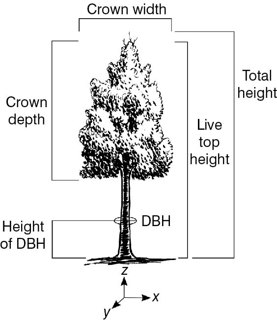
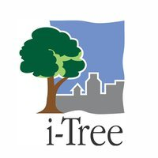

# 2105 NYC Air Quality Analysis Dashboard
Flask web application that shows if air quality differs significantly among neighborhoods.

### Background
For parents of children with chronic respiratory illnesses, there are many factors to consider when looking for a place to call home. We hope this dashboard will give families an additional resource during the home buying/renting process.

### Web Scraping
- NYC Neighborhood Zipcodes
- BeautifulSoup script collects the zipcodes for every neighborhood in New York City as determined by the United Hospital Fund

### Languages/Libraries
- D3 Library for data collection and web layout
- Javascript/HTML/CSS to build webpage
- Leaflet.js to provide responsive maps
- Materialize to create the dashboard
- Python/Pandas/BeautifulSoup modules for data extraction and cleaning

### Flask Application
The Flask application is hosted on Github Pages. A user can click the link in the repository to view the dashboard.

Alternatively, it can run locally. First, clone or download the entire directory. It requires a config.js file with the user’s Mapbox API key. Then, navigate to the folder with the index.html file and open a local server through the command line.

### Requirements
- pandas==0.23.3
-  Flask==1.0.2
- requests==2.18.4
- beautifulsoup4==4.6.3
- Flask-PyMongo==2.1.0
- NumPy
- OS
- D3
- Python

### Resources

Learn about [i-Tree](https://www.itreetools.org)

Datasets:
Air Quality 
https://aqs.epa.gov/aqsweb/documents/data_api.html
	
Tree Census
https://data.cityofnewyork.us/Environment/2015-Street-Tree-Census-Tree-Data/uvpi-gqnh

NYC Census
https://www.census.gov/programs-surveys/acs/data/pums.html
      
NYC Uhf Zip Codes 
            https://www.nycfoodpolicy.org/nyc-foodscapes-community/

https://jsspina.carto.com/tables/nyc_zip_code_tabulation_areas_polygons/public/map

NYC Zipcodes GeoJSON
https://data.beta.nyc/dataset/nyc-zip-code-tabulation-areas/resource/6df127b1-6d04-4bb7-b983-07402a2c3f90

NYC UHF Neighborhoods Zip Codes Table to Scrape
https://www.health.ny.gov/statistics/cancer/registry/appendix/neighborhoods.htm
https://www1.nyc.gov/assets/doh/downloads/pdf/ah/zipcodetable.pdf

Modified Zip Code Tabulation Areas
https://data.cityofnewyork.us/Health/Modified-Zip-Code-Tabulation-Areas-MODZCTA-Map/5fzm-kpwv

NYC Neighborhoods GeoJSON
https://data.cityofnewyork.us/City-Government/Neighborhood-Tabulation-Areas-NTA-/cpf4-rkhq

NYC Million Trees Project
https://www.milliontreesnyc.org/html/about/about.shtml

